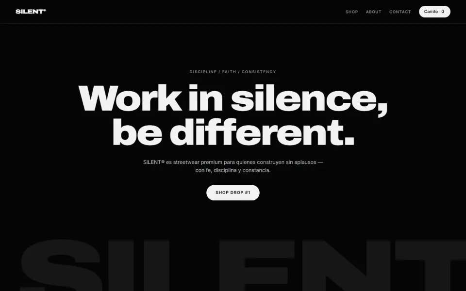
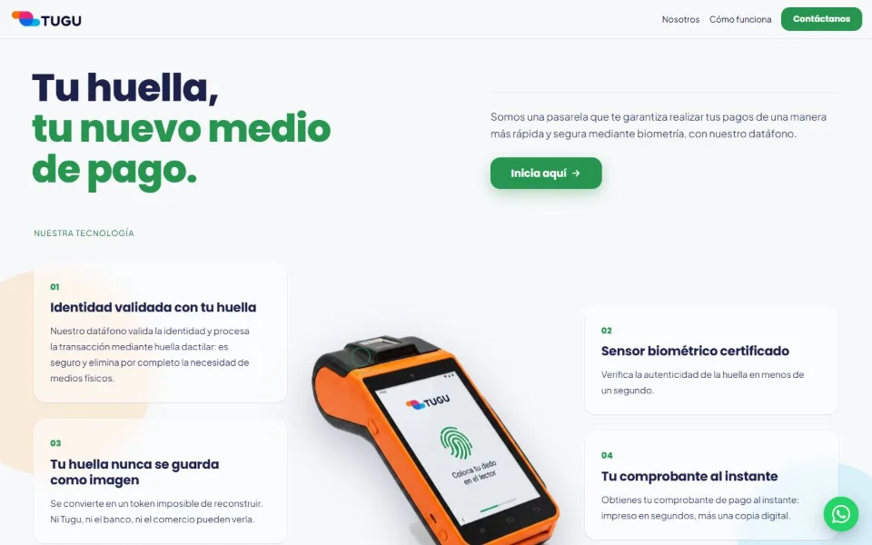
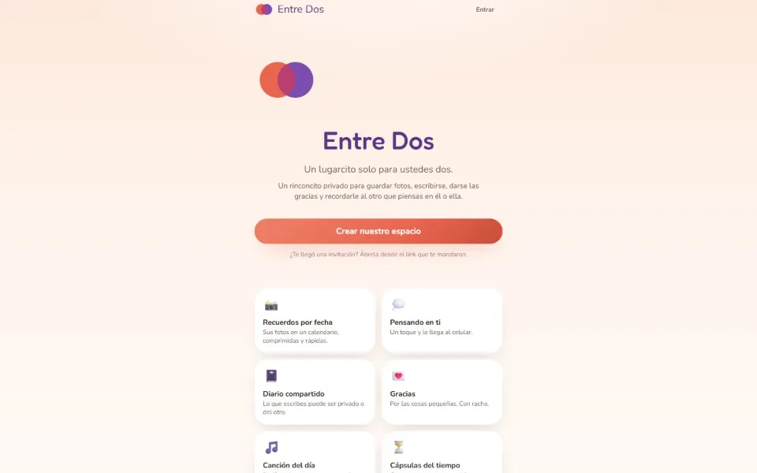
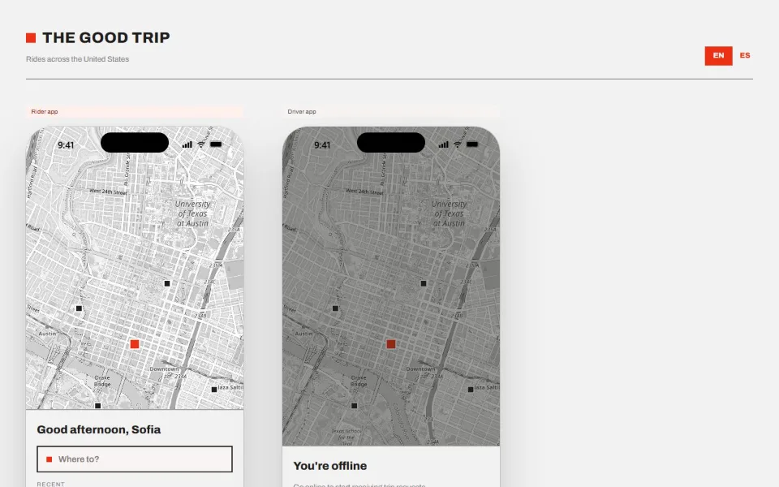
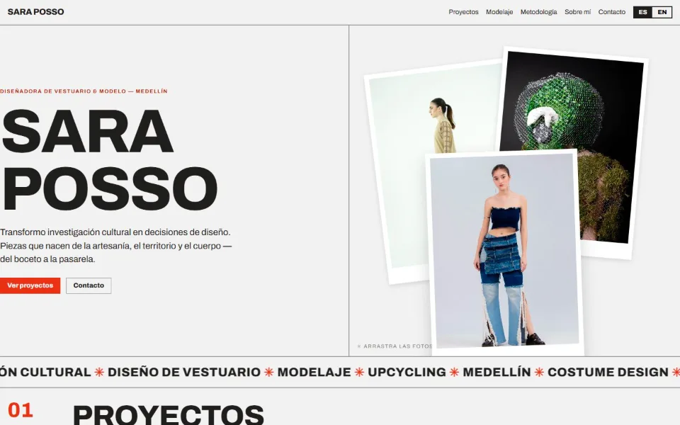
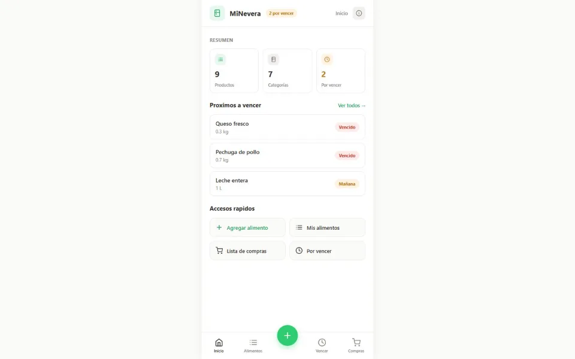

  
  
  

Convierto procesos de negocio en software que funciona: tiendas, apps que se instalan en el celular y sistemas de gestión a medida. Vengo de la ingeniería de procesos, así que antes de programar me siento a entender cómo opera el negocio y dónde se pierde el tiempo.

## Ahora mismo

- **Trabajo en [Tugu](https://tugu-landing.vercel.app)**, una fintech de pagos con huella digital.
- **Construyo mi asistente personal**: una app donde la IA es el centro, conversa conmigo, anota post-its y tareas y me manda los avisos al iPhone.
- **Preparo [Vuelta](#en-el-taller)**, una app de domicilios de barrio para Medellín.
- **Estudio** en la Universidad Pontificia Bolivariana.

## En producción

<table>
  <tr>
    <td width="33%" valign="top">
      
      <b><a href="https://silentofficial-co.vercel.app">SILENT®</a></b> 
      Tienda online de streetwear con catálogo por drops y carrito.
    </td>
    <td width="33%" valign="top">
      
      <b><a href="https://tugu-landing.vercel.app">Tugu</a></b> 
      Landing de una fintech de datáfonos con lector de huella.
    </td>
    <td width="33%" valign="top">
      
      <b><a href="https://entredos-psi.vercel.app">Entre Dos</a></b> 
      Espacio privado para parejas: recuerdos, diario y cápsulas del tiempo.
    </td>
  </tr>
  <tr>
    <td width="33%" valign="top">
      
      <b><a href="https://www.thegoodtrip.online">The Good Trip</a></b> 
      Prototipo de app de transporte con vistas de pasajero y conductor.
    </td>
    <td width="33%" valign="top">
      
      <b><a href="https://sara-posso-portafolio.vercel.app">Sara Posso</a></b> 
      Portafolio bilingüe para una diseñadora de vestuario.
    </td>
    <td width="33%" valign="top">
      
      <b><a href="https://zteve0.github.io/AppHibridaEntrga2/">MiNevera</a></b> 
      Despensa del hogar con alertas de vencimiento; funciona sin internet. En equipo.
    </td>
  </tr>
</table>

## En el taller

| Proyecto | Qué es | Con qué |
|---|---|---|
| **Asistente personal** | La IA conversa, anota post-its y tareas y programa mis avisos. Se respalda sola y llega al iPhone como notificación. | Flutter · Riverpod · Drift · Postgres · Web Push |
| **Vuelta** | Domicilios de barrio: el cliente escribe su lista y hace una oferta; un domiciliario verificado compra y entrega con PIN. | React · Vite · Firebase · Wompi |
| **Nimbo** | Una nubecita de escritorio que vigila mis sesiones de Claude Code y reparte los pedidos entre ellas. Nunca envía nada sin que yo lo apruebe. | Electron |
| **Yggdrasil** | Progresión scout con mitología nórdica: los reinos se desbloquean con méritos aprobados. | Next.js · Supabase |
| **Valkiria** | App móvil con una mascota animada que reacciona al toque. La dibujo y la animo yo. | React Native · Rive |

## Ingeniería

- [**Sistema de archivos distribuido**](https://github.com/FedericoChalaca/tadb202610_proyecto_dfs) — un NameNode y tres DataNodes con replicación y tolerancia a fallos. Python y FastAPI.
- [**Pizzería en .NET 9**](https://github.com/FedericoChalaca/Pizzeria-Arquitectura) — refactor completo hacia SOLID y DDD: repositorios, objetos de valor, agregados y patrones GoF.
- [**Este portafolio**](https://github.com/FedericoChalaca/portfolio-federico) — React, TypeScript y un portátil en 3D con Three.js.

## Con qué trabajo

  
  
  
  
  
  
  
  
  
  
  
  
  

## Cómo trabajo

1. **Entiendo la operación.** Quién hace qué, dónde se pierde tiempo y qué vale la pena automatizar.
2. **Construyo por entregas.** Avances que se pueden probar desde el primer ciclo, para corregir el rumbo cuando todavía es barato.
3. **Entrego algo que crece.** Código ordenado, con pruebas, desplegado y listo para evolucionar.

## Fuera del código

Dirijo un clan scout, pinto camisas a mano y mi perrita se llama Valkiria (sí, la app lleva su nombre).

English

 

I'm Federico, a full-stack developer in Medellín, Colombia. I turn business processes into working software: online stores, installable web apps and custom management systems. I currently work at Tugu, a fingerprint-payments fintech, and I'm building an AI-first personal assistant on the side.

Reach me at [federicoml2004@gmail.com](mailto:federicoml2004@gmail.com) or on [LinkedIn](https://www.linkedin.com/in/federico-martinez-10b58931a/).

